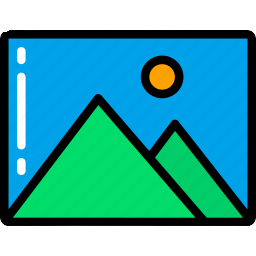

# Picture-finder

## _Find any picture_

Приложение с авторизацией и регистрацией пользователя. Оно взаимодействует сразу с двумя API:

- API авторизации `https://auth.nomoreparties.co`;
- API редактирования пользователя и получения карточек `https://mesto.nomoreparties.co/v1`.

Учебный проект от Яндекс.Практикум.
Профессия Веб-разработчик

- Основы бэкенда для фронтенд-разработчиков
- Фронтенд-аутентификация на React
- ✨Magic ✨

## Инструкция по запуску приложения

- Клонировать проект https://github.com/sergeyladorski/react-mesto-auth.git;
- Установить зависимости npm install;
- Запустить локальный сервер npm start. В браузере откроется проект по адресу http://localhost:3000.

## Features

- Проект создан использует API сервиса Unsplash — источником бесплатных изображений в Интернете.
- Созданы роуты и описаны перенаправления:
  - /photos/:photoId — при клике на карточку пользователь перенаправляется на страницу просмотра изображения.
- 
- 

## Tech

В проекте задействованы следующие технологии:

- HTML;
- CSS;
- ReactJS;
- ReactHooks;
- ReactRouter;
- API;
- Webpack;
- Git.

## Планы по доработке проекта:

- Настроить выдачу большего числа результатов с пагинацией.

Перейти на [страницу проекта](https://sergeyladorski.github.io/picture-finder/)).  
Больше моих проектов на [GitHub](https://github.com/sergeyladorski)).

**Sergey Ladorski**